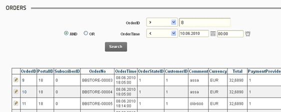
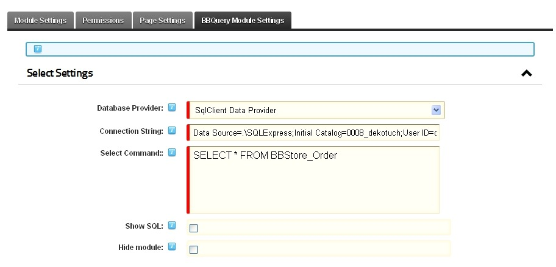
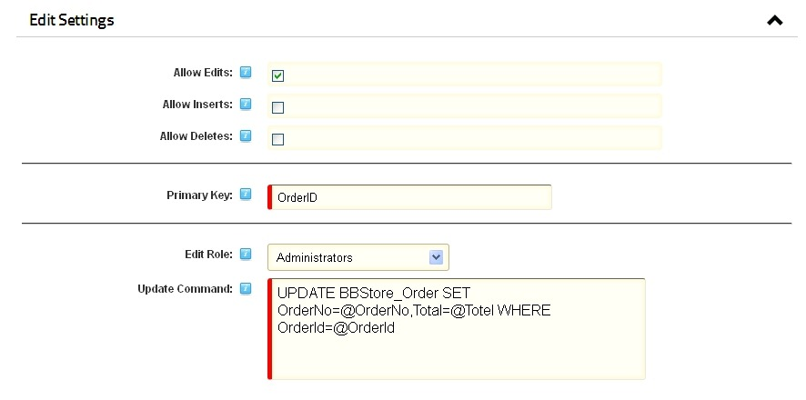
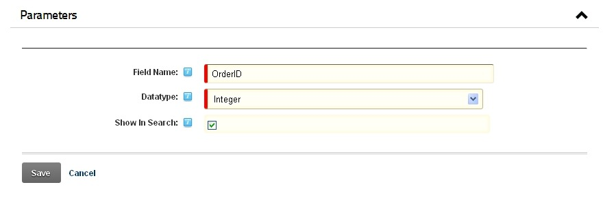
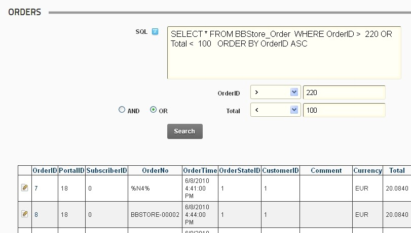
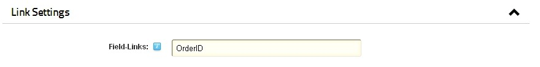
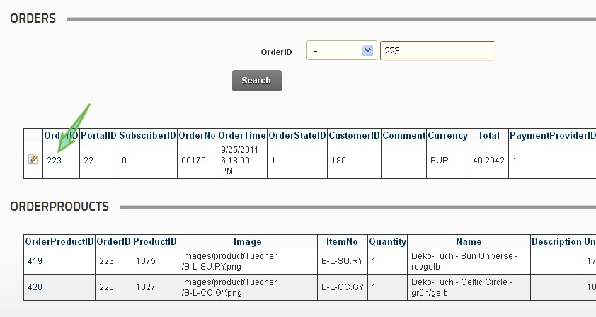

## Project Description

The _bitboxx bbquery_ module is a DNN module for querying and editing database tables. Its intention is more for intranet than internet. You can define database querys (selects) to every kind of database (if drivers are installed) and even edit the tables if configured like this. if you or your employees need to fire every morning the same query to the database to check if nightly production went well and every record is on his right place, this is the module for you! The minimum DNN Version for this module is **06.01.00.**

These are the main features:

*   Define Database Query per SELECT Statement
*   Query every database type with installed OLEDB Drivers
*   Editing, Inserting and Deleting records
*   Role Based permissions for INSERTs, UPDATEs and DELETEs
*   Define Parameters for search (visually or only per URL-Parameter)
*   Define the fields which should be displayed as links (one-to-many relations)

## Documentation

### General settings

After the _bitboxx bbquery_ module is added to a page the settings (via "manage" - "Settings") must be edited first. In addition to the normal module settings,  the special BBQuery module settings are found in the last tab.

<table border="1" cellspacing="0" cellpadding="3">
<tbody>
<tr>
<td valign="top">Database Provider</td>
<td valign="top">Please select the database provider for connection to your data source</td>
</tr>
<tr>
<td valign="top">Connection String</td>
<td valign="top">Please enter the connection string for connection to your data source</td>
</tr>
<tr>
<td valign="top">Select Command</td>
<td valign="top">Enter the SELECT SQL command which selects the data to be shown in result view</td>
</tr>
<tr>
<td valign="top">Show SQL</td>
<td valign="top">Shows the SQL statement which leads to the displayed data</td>
</tr>
<tr>
<td valign="top">Hide module</td>
<td valign="top">if checked module is only shown if one of the defined search parameters is filled</td>
</tr>
</tbody>
</table>

After saving the settings, the SELECT query is immediately executed and the results are displayed. Columns In the grid could be sorted by clicking the column headers.

### Edit Settings

The administrator could define individual roles for adding, editing and deleting permissions to allow users  some users the changing of database content. If editig is enabled, the primary key the and corresponding SQL statements for updating, inserting and deleting should be entered. All fields to be modified must be included in the SQL statement, because otherwise they are not taken to account when you run the command.

<table border="1" cellspacing="0" cellpadding="3">
<tbody>
<tr>
<td valign="top">Allow Edits / Inserts / Deletes</td>
<td valign="top">Check if you want to allow special users to edit / insert / delete records</td>
</tr>
<tr>
<td valign="top">Primary Key</td>
<td valign="top">Please enter the primary key of your selection (needed for inserts, updates, deletes)</td>
</tr>
<tr>
<td valign="top">Edit/ Insert / Update – Role</td>
<td valign="top">Select the role a user needs to be allowed to edit, insert or delete records</td>
</tr>
</tbody>
</table>

### Parameters

Parameters are the “variables” in the database query. They can be defined in the parameters section.  After clicking on "new",  you could specify the name of the field and its data type. The field name (and type) must match one of the fields in the selection.

<table border="1" cellspacing="0" cellpadding="3">
<tbody>
<tr>
<td valign="top">Field Name</td>
<td valign="top">Please enter the field name of the search field</td>
</tr>
<tr>
<td valign="top">Datatype</td>
<td valign="top">Please enter the data type of the search field</td>
</tr>
<tr>
<td valign="top">Show in search</td>
<td valign="top">Select if the parameter should be shown as a search field or only be a non visible URL parameter</td>
</tr>
</tbody>
</table>

Parameters that are not “shown in search” could only be used in the URL (eg. http://www.mydomain.de/pagename.aspx?field1=value1&field2=value2). But remark that the advanced query options (“>”,”<”,”contains”, “AND/OR”) could not be used when using URL syntax. If you added one or more parameters to the search fields, they could be easily used to filter the selection. Parameters could be combined using AND or OR. Empty parameters are ignored ! If “Show Sql” is enabled you can see the actually used SQL statement  on any time.

### Link Settings

The link settings are used to define one or more fields, which should act as a link to a detailed view of the selected record (e.g. one to many scenario). For this please enter the name of the fields as a comma separated list.

### Sample

If you would like to have a master-detail view of orders and order related items, you need two modules for this. The first will display above the orders as in the example. We define the OrderID as the link field and as a parameter field.

The second module (SELECT * FROM BBStore_Orderproducts) needs the OrderID too as a parameter. But we define the module as only displayed if the data is filtered (option "hide module"). If you click now in the orders module on the link of an order, the corresponding position sets are displayed in the positions module.

